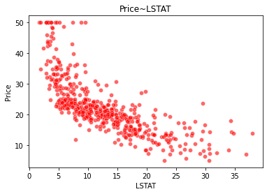
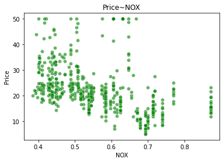

## 针对回归问题，构建回归模型预测 （以Boston_data为例）


```python
# display
from IPython.core.display import HTML
import random
# matplotlib
import matplotlib.pyplot as plt
%matplotlib inline
import seaborn as sns
```


```python
from sklearn import datasets
import pandas as pd
import numpy as np
boston = datasets.load_boston()     # 返回一个类似于字典的类
X = boston.data
y = boston.target
features = boston.feature_names
boston_data = pd.DataFrame(X,columns=features)
boston_data["Price"] = y
# boston_data.head()
```


```python
print (boston.DESCR)
```

    .. _boston_dataset:
    
    Boston house prices dataset
    ---------------------------
    
    **Data Set Characteristics:**  
    
        :Number of Instances: 506 
    
        :Number of Attributes: 13 numeric/categorical predictive. Median Value (attribute 14) is usually the target.
    
        :Attribute Information (in order):
            - CRIM     per capita crime rate by town
            - ZN       proportion of residential land zoned for lots over 25,000 sq.ft.
            - INDUS    proportion of non-retail business acres per town
            - CHAS     Charles River dummy variable (= 1 if tract bounds river; 0 otherwise)
            - NOX      nitric oxides concentration (parts per 10 million)
            - RM       average number of rooms per dwelling
            - AGE      proportion of owner-occupied units built prior to 1940
            - DIS      weighted distances to five Boston employment centres
            - RAD      index of accessibility to radial highways
            - TAX      full-value property-tax rate per $10,000
            - PTRATIO  pupil-teacher ratio by town
            - B        1000(Bk - 0.63)^2 where Bk is the proportion of blacks by town
            - LSTAT    % lower status of the population
            - MEDV     Median value of owner-occupied homes in $1000's
    
        :Missing Attribute Values: None
    
        :Creator: Harrison, D. and Rubinfeld, D.L.
    
    This is a copy of UCI ML housing dataset.
    https://archive.ics.uci.edu/ml/machine-learning-databases/housing/
    
    
    This dataset was taken from the StatLib library which is maintained at Carnegie Mellon University.
    
    The Boston house-price data of Harrison, D. and Rubinfeld, D.L. 'Hedonic
    prices and the demand for clean air', J. Environ. Economics & Management,
    vol.5, 81-102, 1978.   Used in Belsley, Kuh & Welsch, 'Regression diagnostics
    ...', Wiley, 1980.   N.B. Various transformations are used in the table on
    pages 244-261 of the latter.
    
    The Boston house-price data has been used in many machine learning papers that address regression
    problems.   
         
    .. topic:: References
    
       - Belsley, Kuh & Welsch, 'Regression diagnostics: Identifying Influential Data and Sources of Collinearity', Wiley, 1980. 244-261.
       - Quinlan,R. (1993). Combining Instance-Based and Model-Based Learning. In Proceedings on the Tenth International Conference of Machine Learning, 236-243, University of Massachusetts, Amherst. Morgan Kaufmann.
    


```python
sns.scatterplot(boston_data['LSTAT'],boston_data['Price'],color="r",alpha=0.6)
plt.title('Price~LSTAT')
plt.show()

sns.scatterplot(boston_data['NOX'],boston_data['Price'],color="g",alpha=0.6)
plt.title("Price~NOX")
plt.show()

sns.scatterplot(boston_data['RM'],boston_data['Price'],color="b",alpha=0.6)
plt.title("Price-RM")
plt.show()
```

    /Users/hirahtang/opt/anaconda3/lib/python3.8/site-packages/seaborn/_decorators.py:36: FutureWarning: Pass the following variables as keyword args: x, y. From version 0.12, the only valid positional argument will be `data`, and passing other arguments without an explicit keyword will result in an error or misinterpretation.
      warnings.warn(


    

    


    /Users/hirahtang/opt/anaconda3/lib/python3.8/site-packages/seaborn/_decorators.py:36: FutureWarning: Pass the following variables as keyword args: x, y. From version 0.12, the only valid positional argument will be `data`, and passing other arguments without an explicit keyword will result in an error or misinterpretation.
      warnings.warn(


    

    


    /Users/hirahtang/opt/anaconda3/lib/python3.8/site-packages/seaborn/_decorators.py:36: FutureWarning: Pass the following variables as keyword args: x, y. From version 0.12, the only valid positional argument will be `data`, and passing other arguments without an explicit keyword will result in an error or misinterpretation.
      warnings.warn(


    

    


### Linear Regression Approach

We use three features:

RM       average number of rooms per dwelling

LSTAT    % lower status of the population

NOX      nitric oxides concentration (parts per 10 million)

for modelling, for the sake of preventing the process from overcomplicated


```python
X = np.array(boston_data[['RM', 'LSTAT', 'NOX']])
```


```python
y = np.array(boston_data['Price'])
```


```python
X.shape, y.shape
```


    ((506, 3), (506,))


## The formula of linear regression is straightforward

We use Mean Squared Error as loss to evaluate the model 


```python
# We need to randomly initialize the parameters as the starting point
def theta_initialize(n):
    theta = np.array([random.uniform(-10, 10) for i in range(n)])
    return theta

def ms_error(X, theta, y):
    return np.mean((np.dot(X, theta.T) - y) ** 2)
    
```


```python
theta = theta_initialize(3)
```


```python
ms_error(X, theta, y)
```


    8527.365975391192


## We use our randomly initialized parameters to calculate the y. It performs terribly, of course, with a MSE of 8000+,

## and a r_squared of -100.01


```python
def r_squared(X, theta, y):
    
    y_pred = np.dot(X, theta.T)
    y_mean = np.mean(y)
#    print (sum((y - y_pred) ** 2), sum((y - y_mean) ** 2))
    return 1 - sum((y - y_pred) ** 2) / sum((y - y_mean) ** 2)
```


```python
r_squared(X, theta, y)
```


    -100.0117366598876


### We either use normal equation or gradient descent approach to find the minimum value of this loss function


```python
# Normal Equation

def normal_equation(X, y):
    
    theta_ = np.dot(np.dot(np.linalg.inv(np.dot(X.T, X)), X.T), y)
    print (ms_error(X, theta_, y), r_squared(X, theta_, y))
    return theta_
```


```python
normal_equation(X, y)
```

    30.486331067443835 0.6388712230250545


    array([ 5.02793054, -0.62823881, -2.00550235])


我们由此得到了对应的模型系数和模型得分

#### Bonus: polynomial expansion of linear regression


```python
def poly(x, degree):
    output = np.array([1 for i in range(x.shape[0])]) # Create the column for the constant parameter theta_0
    for i in range(1, degree+1):
        output = np.column_stack((output, (x**i - np.mean(x**i)) / np.std(x**i)))   # Normalize the features 
#        output = np.vstack((output, x**i))
    return output.T   
```


```python
normal_equation(poly(X, 2).T, y)
```

    20.85646040870699 0.7529427853171229


    array([-1.72318744e+03, -1.67844792e+02, -9.24907175e+00,  1.76899920e+02,
            3.86389862e+02,  3.69555118e+00, -3.95672726e+03])


## We expand to quatratic features, and find the model improves, when measured by r squared and MSE

Though, we need to conduct data partition, as we need seperate data from the training set as testing data

We take 70% as training data, and use the rest 30% for evaluation


```python
opt_theta = normal_equation(poly(X[:354], 2).T, y[:354])
```

    10.057847053300067 0.8583146601718517


```python
ms_error(poly(X[354:], 2).T, opt_theta, y[354:]), r_squared(poly(X[354:], 2).T, opt_theta, y[354:])
```


    (13884.434525803126, -208.27226204537527)


```python
opt_1 = normal_equation(X[:354], y[:354])
```

    20.342269617620058 0.7134375410190152


```python
ms_error(X[354:], opt_1, y[354:]), r_squared(X[354:], opt_1, y[354:])
```


    (55.4231331560181, 0.16463832764330466)


However, the model could not deliver a promising result in the testing set, as in the training set.

### GAM

## Regression Tree Approach

## Support Vector Regressor

## Support Vector Regressor

## Feature Selection

## Regularization

## Dimension Reduction

## Hyperparameter Tuning
