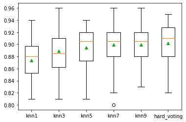

## Majority Voting


```python
from sklearn.linear_model import LogisticRegression 
from sklearn.svm import SVC
from sklearn.ensemble import VotingClassifier
from sklearn.pipeline import make_pipeline
from sklearn.preprocessing import StandardScaler
from sklearn.model_selection import RepeatedStratifiedKFold
```


```python
from sklearn.datasets import make_classification # define dataset
def get_dataset():
    X, y = make_classification(n_samples=1000, n_features=20, n_informative=15,
n_redundant=5, random_state=2)
    # summarize the dataset
    return X,y
```


```python
models = [('lr',LogisticRegression()),('svm',SVC())]
ensemble = VotingClassifier(estimators=models, voting='soft')
```


```python
def get_voting():
    models = list()
    models.append(('knn1', KNeighborsClassifier(n_neighbors=1))) 
    models.append(('knn3', KNeighborsClassifier(n_neighbors=3))) 
    models.append(('knn5', KNeighborsClassifier(n_neighbors=5))) 
    models.append(('knn7', KNeighborsClassifier(n_neighbors=7))) 
    models.append(('knn9', KNeighborsClassifier(n_neighbors=9)))
# define the voting ensemble
    ensemble = VotingClassifier(estimators=models, voting='hard') 
    return ensemble

```


```python
# get a list of models to evaluate
def get_models():
    models = dict()
    models['knn1'] = KNeighborsClassifier(n_neighbors=1)
    models['knn3'] = KNeighborsClassifier(n_neighbors=3)
    models['knn5'] = KNeighborsClassifier(n_neighbors=5)
    models['knn7'] = KNeighborsClassifier(n_neighbors=7)
    models['knn9'] = KNeighborsClassifier(n_neighbors=9)
    models['hard_voting'] = get_voting()
    return models
```


```python
# evaluate a give model using cross-validation
from sklearn.model_selection import cross_val_score #Added by ljq 
def evaluate_model(model, X, y):
    cv = RepeatedStratifiedKFold(n_splits=10, n_repeats=3, random_state=1)
    scores = cross_val_score(model, X, y, scoring='accuracy', cv=cv, n_jobs=-1, error_score='raise')
    return scores
```


```python
from sklearn.neighbors import KNeighborsClassifier
from matplotlib import pyplot
```


```python
# define dataset
import numpy as np
X, y = get_dataset()
# get the models to evaluate
models = get_models()
# evaluate the models and store results 
results, names = list(), list()
for name, model in models.items():
    scores = evaluate_model(model, X, y)
    results.append(scores)
    names.append(name)
    print('>%s %.3f (%.3f)' % (name, np.mean(scores), np.std(scores)))
# plot model performance for comparison
pyplot.boxplot(results, labels=names, showmeans=True) 
pyplot.show()
```

    >knn1 0.873 (0.030)
    >knn3 0.889 (0.038)
    >knn5 0.895 (0.031)
    >knn7 0.899 (0.035)
    >knn9 0.900 (0.033)
    >hard_voting 0.902 (0.034)





### Regressor Voting

Take the average of all the results.

### Classifier Voting

Hard voting: vote by the sum of all the classes

Soft Voting: vote by the sum of all the class possibilities

## Two prerequisites for majority voting technique:

The performances of all classifiers should be close

Selected classifiers should be some levels of variability


```python

```
